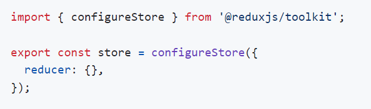
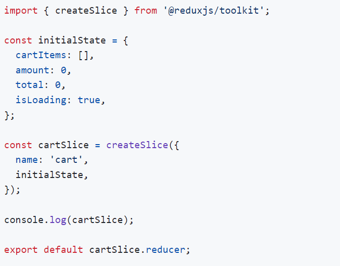

> Repo - https://github.com/john-smilga/redux-toolkit-tutorial/blob/main/final/README.md

# Install
- npx create-react-app my-app
- for latest npx create-react-app@latest my-app
- npm install @reduxjs/toolkit react-redux

# liberary
- redux (core library, state management)
- immer (allows to mutate state)
- redux-thunk (handles async actions)
- reselect (simplifies reducer functions)

# Setup Store
- creat store

# provider
- index.js

# cartSlice

