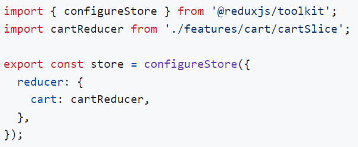
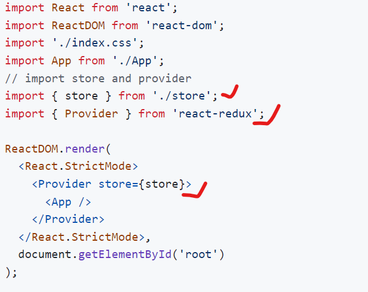
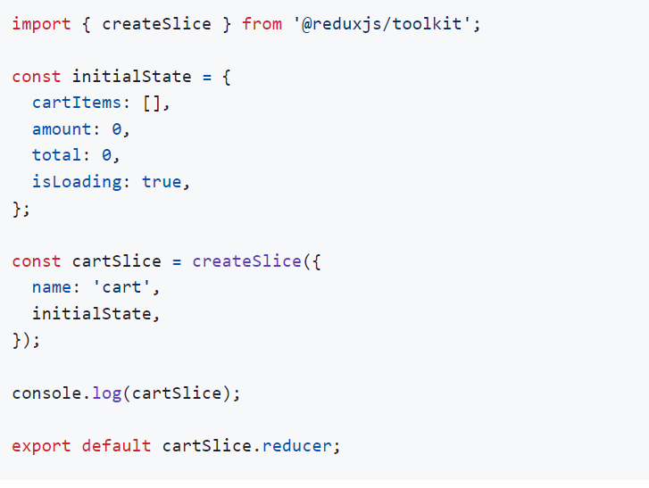
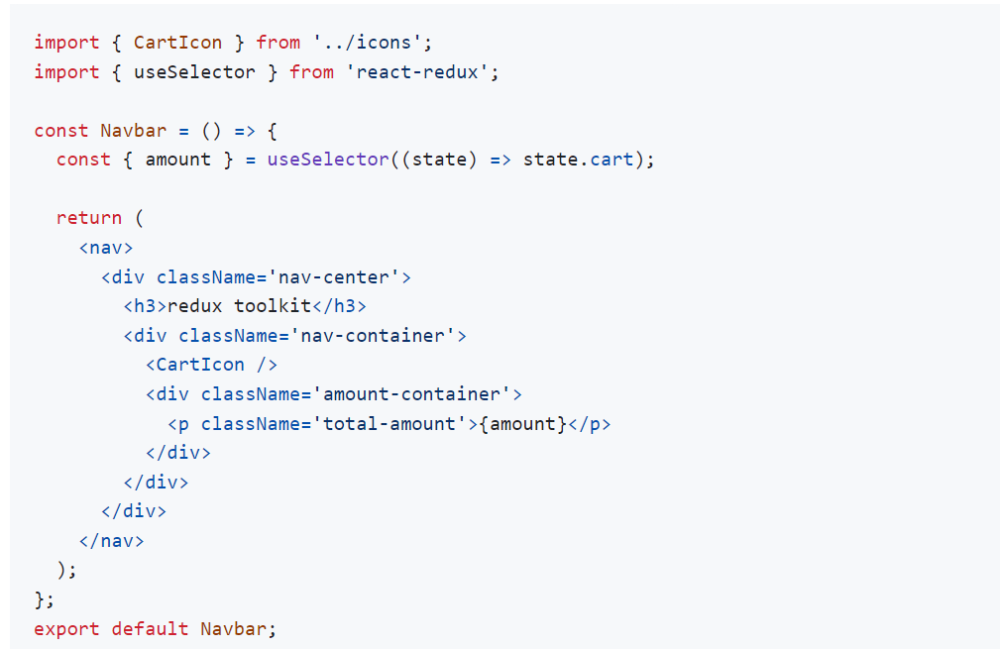

> Repo - https://github.com/john-smilga/redux-toolkit-tutorial/blob/main/final/README.md

> For Icons - https://heroicons.com/ for SVG ICONS

> TASK IN REDUX
 1. Creat three button increase , decress, and clear all button increase +1
 - Ans - reduxcreat / Task

# Install
- npx create-react-app my-app
- for latest npx create-react-app@latest my-app
- npm install @reduxjs/toolkit react-redux

# liberary
- redux (core library, state management)
- immer (allows to mutate state)
- redux-thunk (handles async actions)
- reselect (simplifies reducer functions)

# Setup Store
- creat store

# provider
- index.js

# cartSlice

- for mutate state i will use reduser inside of card slice.

# creat component

